# PSD Importer Inspector properties
The PSD Importer is available after you import a .psb file into your Project. Select the .psb Asset file and set its **Texture Type** to [Sprite (2D and UI)](https://docs.unity3d.com/Manual/TextureTypes.html#Sprite). The PSD Importer properties are split between two main tabs, with the following properties available.

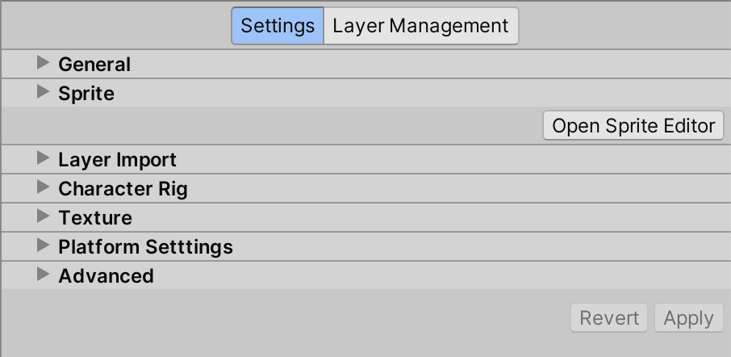  PSD Importer Inspector properties

## Settings tab
The Settings tab allows you to customize how the PSD Importer imports a file. The settings are categorized into individual section fold-outs.

### General

| Property                                                     | Function                                                     |
| ------------------------------------------------------------ | ------------------------------------------------------------ |
| __Texture Type__                                             | Select [Sprite (2D and UI)](https://docs.unity3d.com/Manual/TextureTypes.html#Sprite) to import the Texture as a [Sprite](https://docs.unity3d.com/Manual/Sprites.html). The is required to begin using the imported Texture with the [2D Animation](https://docs.unity3d.com/Packages/com.unity.2d.animation@latest/) package. |

###Sprite
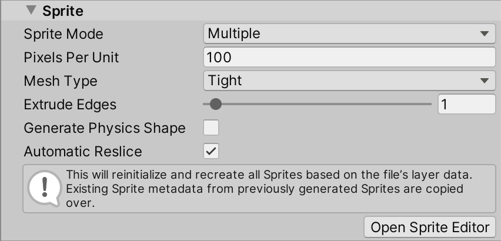
Property  |Function  
--|--
**Sprite Mode**  |  Use this property to specify how Unity extracts the Sprite graphic from the image. This property is set to __Multiple__ by default.
&nbsp;&nbsp;Single  |Select this option to have Unity treat the imported Texture as a single Sprite Asset without multiple individual parts. This is ideal for characters which are drawn on a single layer in the source file instead of being split onto multiple layers.  
&nbsp;&nbsp;Multiple  |This is the default option. Select this option to have Unity create a Sprite for each layer in the source file. This is ideal for complex artwork which has different parts split between multiple layers in the source file, and prepares the imported Textures for animation with the [2D Animation](https://docs.unity3d.com/Packages/com.unity.2d.animation@latest) package.  
|**Pixels Per Unit**                                        | Sets the number of pixels that equal to one Unity unit.    
| __Mesh Type__                                                | Sets the Mesh type that Unity generates for the Sprite. This is set to __Tight__ by default.
|&nbsp;&nbsp;[Full Rect](https://docs.unity3d.com/Documentation/ScriptReference/SpriteMeshType.FullRect.html) | Unity maps the Sprite onto a rectangular Mesh.
|&nbsp;&nbsp;[Tight](https://docs.unity3d.com/Documentation/ScriptReference/SpriteMeshType.Tight.html) | Unity generates a Mesh based on the outline of the Sprite. If the Sprite is smaller than 32 x 32 pixels, Unity always maps it onto a **Full Rect** quad Mesh, even if you select **Tight**.   |
[Extrude Edges](https://docs.unity3d.com/Manual/Glossary.html#ExtrudeEdges) | Use the slider to determine how much to extend the Mesh from the edge of the Sprite. |
**Generate Physics Shape**|  Enable this option to generate a default [Physics Shape](https://docs.unity3d.com/2017.4/Documentation/Manual/SpritePhysicsShapeEditor.html) from the outline of the Sprite, if a [Custom Physics Shape](https://docs.unity3d.com/Manual/CustomPhysicsShape.html) has not be defined. |
[Automatic Reslice](#automatic-reslice)  | This is available only when the **Import Mode** is set to [Individual Sprites (Mosaic)](#Mosaic). Enable this setting to regenerate the Sprite from the imported layers and clear any changes you have made to the Sprite and its metadata.  |

####Automatic Reslice
Enable this setting to discard all user modifications for the current set of [SpriteRect](https://docs.unity3d.com/Packages/com.unity.2d.sprite@1.0/api/UnityEditor.SpriteRect.html) data and regenerate all SpriteRects based on the current source file. Extra SpriteRect metadata (such as weights and bones data) persist if they remain valid with the regenerated SpriteRects.

###Layer Import
The following section is only available if the **Texture Type** is set to **Multiple**.

Property  |Function  
--|--
**Import Mode**  |  Use this property to specify how the layers from the source file are imported. This property is set to **Individual Sprites (Mosaic)** by default.
&nbsp;&nbsp;[Individual Sprites (Mosaic)](#Mosaic)|Select this option to have the PSD Importer generate individual Sprites from  the individual layers of the source file, and combines them into a single Texture in a Sprite sheet layout.  
&nbsp;&nbsp;[Merged](#merged)  | Select this to have the PSD Importer generate a Texture with all layers merged.
**Layer Name**  |This setting is only available if you set the **Import Mode** to **Individual Sprites (Mosaic)**. Use this property to specify how the importer handles layer names when duplicated layer names are found. This property is set to **Keep Duplicate Names** by default.  
&nbsp;&nbsp;[Keep Duplicate Names](#keep-duplicate-names) | Select this to have the PSD Importer generate Sprites from the source files with the exact same name as their source layers, even when there are multiple layers with the same name.
&nbsp;&nbsp;Resolve Duplicate Names  | Select this to have the PSD Importer generate Sprites from the source files with the same name as their source layers. If there are multiple layers with the same name, the Sprite’s name will be prefixed with a number.
**Layer**  |This setting is only available if you set the **Import Mode** to **Individual Sprites (Mosaic)**. Use this property to specify how the importer handles layer’s that are set to not visible in the source file. This property is set to **Visible Layers Only** by default.   |  
&nbsp;&nbsp;Visible Layers Only  |Select this to only import the visible layers from the source file.  
&nbsp;&nbsp;Include Hidden Layers  |Select this to include the hidden layers of the source file in the import. This produces the same import result as making all layers visible in the source file before you import it into Unity.  |
**Layer Mapping ID**|  Select this option to use the internal ID provided by the .psb file to map between the .psb file’s layer and the generated Sprite.|
&nbsp;&nbsp;Use Layer ID   |Select this to only import the visible layers in the .psb file.   |
&nbsp;&nbsp;Use Layer Name| Select this option to use the name of the layer in the .psb file to map between the .psb file’s layer and the generated Sprite. Note that for this option to work correctly, each layer's name needs to be unique. Duplicated names might cause layers to be mapped to the wrong Sprite.|
&nbsp;&nbsp;Use Layer Name (Case Sensitive)   |  Select this option to use the name of the layer (with case sensitivity) in the .psb file to map between the .psb file’s layer and the generated Sprite. Note that for this option to work correctly, each layer's name needs to be unique. Duplicated names might cause layers to be mapped to the wrong Sprite. |
[Layer Group](#layer-group)   |Use this property to specify how the importer handles the Layer group from the source file. This setting is only available when you enable **Use as Rig** and set the **Import Mode** to **Individual Sprites (Mosaic)**.   |
&nbsp;&nbsp;Ignore Layer Groups   |Select this option to have the generated Prefab contain only Layers from the source file while ignoring Layer Groups.   |
&nbsp;&nbsp;As Per Source File   |Select this option to make the importer generate a Prefab that follows the layer and grouping hierarchy of the imported .psb.   |

####<a name="Mosaic">Individual Sprites (Mosaic)</a>
Enable this to have the PSD Importer attempt to create a Texture with each layer from the source file laid out in a mosaic manner.
 The character artwork in Photoshop.
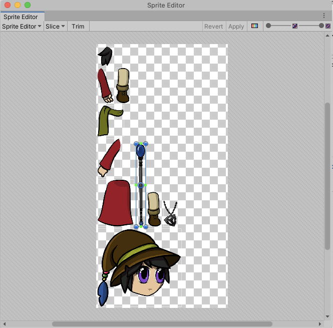 The same file with its individual layers imported as separate Sprites merged into a single Texture in a mosaic formation.

####Merged
Enable this option to have the PSD Importer create a Texture with the layers from the Photoshop file as if all [layers are flattened](https://helpx.adobe.com/photoshop/using/layers.html).
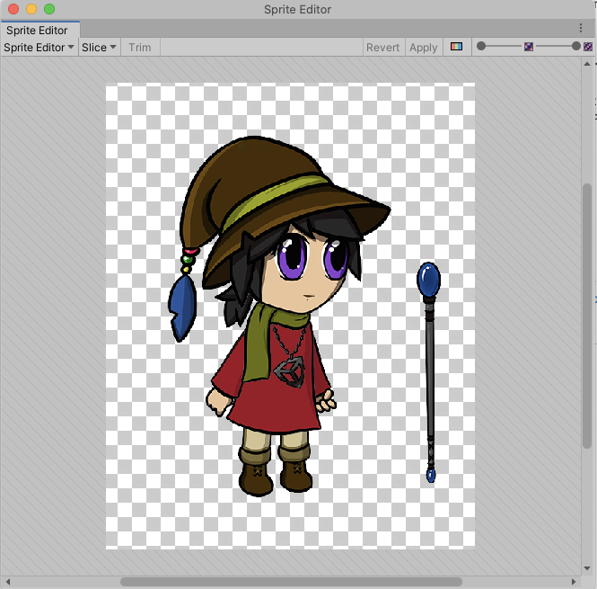

####Keep Duplicate Names
Unity's default import behavior when there are duplicate names is to append "_[number]" to the Sprites and SpriteRects it generates from source layers with identical names. Enable this feature to instead have Unity give both Sprites and SpriteRects the exact same name as their source layer, even when they have duplicate names.

####Layer Group
Refer to the following examples of a character designed in Photoshop and how its original layer hierarchy is transposed to the Prefab generated by the PSD Importer.
   Example 1: Character artwork in Photoshop with different parts separated into different Photoshop layers. The following examples are generated from this source file.

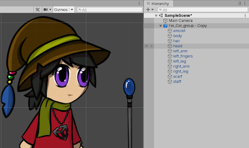 Example 2:The generated Prefab with **Layer Group** set to **Ignore Layer Groups**.

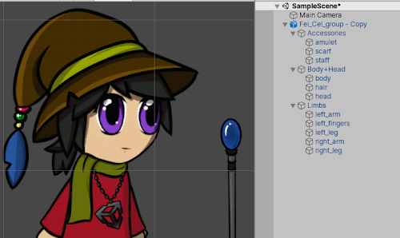 Example 3: The generated Prefab of the same source file with **Layer Group** set to **As Per Source File**.

###Character Rig
This section is only available if the **Texture Type** is set to **Multiple** and **Import Mode** is set to **Individual Sprites (Mosaic)**.

Property  |Function  
--|--
[Use as Rig](#use-as-rig)  |  Enable this property to have the PSD Importer generate a Prefab based on the imported source file. The PSD Importer generates Sprites from the imported layers of the source file, and the Sprites’ [hierarchy](https://docs.unity3d.com/Manual/Hierarchy.html) and positions are based on their [layer hierarchy](https://helpx.adobe.com/photoshop/using/layer-basics.html#layers_panel_overview) and their positions in the source file.
[Main Skeleton](#main-skeleton)  |  This is only available when [Use as Rig](#use-as-rig) is enabled. Assign the **Skeleton Asset** that this character Prefab’s bone hierarchy will reference. If no Skeleton Asset is assigned, the importer will automatically generate a Skeleton Asset as a sub-asset of this character. The Skeleton Asset contains the bone hierarchy of the Asset that was defined in the 2D Animation package's [Skinning Editor](https://docs.unity3d.com/Packages/com.unity.2d.animation@6.0/manual/SkinningEditor.html) (refer to **Skeleton Sharing** for more information).
**Pivot**  |This is only available when **Use as Rig** is enabled. Select the pivot point of the Sprite.  
&nbsp;&nbsp;Custom  |  Define the X and Y coordinates of a custom **Pivot** location.|

####Use as Rig
Enable this property to have the PSD Importer generate a Prefab containing Sprites based on the layers of the imported source file. The PSD Importer also automatically gives the Sprites an [Order in Layer](https://docs.unity3d.com/Manual/2DSorting.html#sortlayer) value that sorts them according to their positions in the layer hierarchy in the source file. As a result, the generated Prefab recreates the arrangement and appearance of the assets in the original source file as closely as possible.

The name of each Sprite in the Prefab is the same as the source layer it is based on, unless a **name collision error** occurs, which is usually due to duplicate names in the source layers.

If the Sprite contains [bone](https://docs.unity3d.com/Packages/com.unity.2d.animation@6.0/manual/SkinEdToolsShortcuts.html#bone-tools) or [weight](https://docs.unity3d.com/Packages/com.unity.2d.animation@6.0/manual/SkinEdToolsShortcuts.html#weight-tools) data, the PSD Importer automatically adds the Sprite Skin component to it. This happens if the Sprite has been [rigged](https://docs.unity3d.com/Packages/com.unity.2d.animation@6.0/manual/CharacterRig.html) with bones and weights in the [Skinning Editor](https://docs.unity3d.com/Packages/com.unity.2d.animation@6.0/manual/SkinningEditor.html) already and the source file is being reimported, or you have manually [copied and pasted](https://docs.unity3d.com/Packages/com.unity.2d.animation@6.0/manual/CopyPasteSkele.html) the bone and weight data onto the Sprites.

####Main Skeleton
A skeleton Asset (.skeleton) is an Asset that contains the bone hierarchy structure that can be animated with the 2D Animation package. The **Main Skeleton** property is only available when you import a .psb file with the **Use As Rig** importer setting enabled. After importing the .psb file, assign a .skeleton Asset to the **Main Skeleton** property to have the generated prefab character be automatically rigged with the bone hierarchy structure contained in that .skeleton Asset.

If there is no .skeleton Asset assigned to the importer’s **Main Skeleton** property, then a .skeleton Asset is automatically generated as a sub-Asset of the imported source file and it will be named ‘[Asset File Name] Skeleton’. You can **share .skeleton Assets** between different generated Prefabs by assigning the same .skeleton as their **Main Skeleton** property when they're imported.

When you open and edit the character in 2D Animation package’s **Skinning Editor**, the module will display the bone hierarchy provided by the Skeleton Asset assigned to **Main Skeleton** for rigging.

## Layer Management Tab
The **Layer Management Tab** allows you to customize how the Importer imports the layers from the Photoshop file.
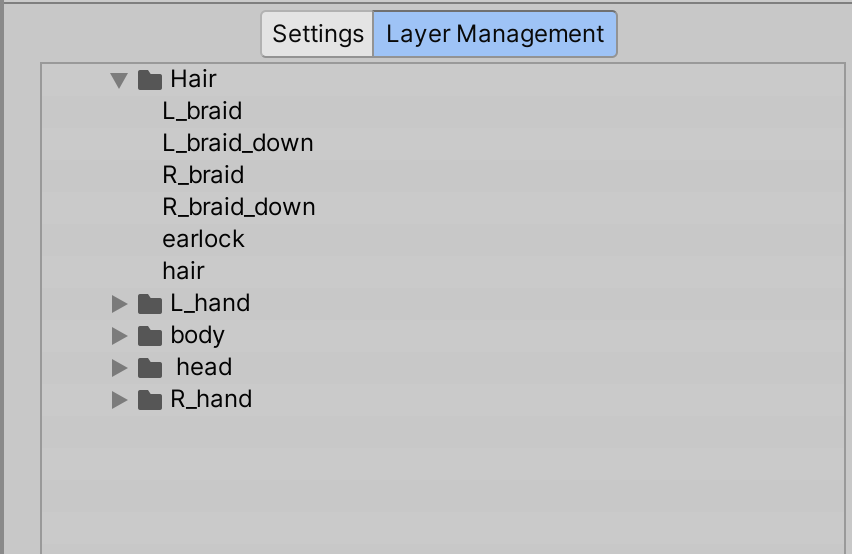

###Layer hierarchy tree
[Group layers](https://helpx.adobe.com/photoshop/using/selecting-grouping-linking-layers.html) in Photoshop are represented with a fold-out folder icon  in the hierarchy tree of the Layer Management tab, while regular Photoshop layers in Photoshop represented only by their names.

###Collapsing Groups
The Photoshop layers in a Group can be collapsed into a single Sprite when imported. Hover the cursor over a Group Layer and the **Collapse** icon appears on its left.
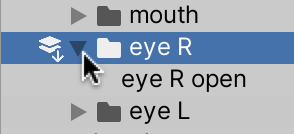 Collapse icon with arrow facing down.

Click the icon to indicate that the layers in the selected Group should be imported as a single Sprite.
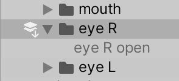 Layers in Collapsed groups are grayed out.

###Uncollapsing Groups
Hovering over a Collapsed Group layer reveals the Uncollapse icon (the arrow faces upwards).

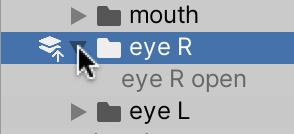 Select the icon again to uncollapse the Group layer and to import all Layers in the Group as separate Sprites.

####Sub-groups within Group layers
If a Group contains other Group layers and is collapsed, then the layers in the sub-groups will also be collapsed into a single Sprite.
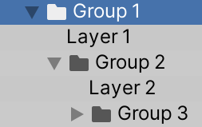 Group 1 containing multiple sub-groups.
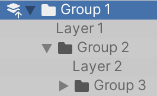 All layers in the sub-groups are grayed out when the parent Group 1 is set to Collapse.

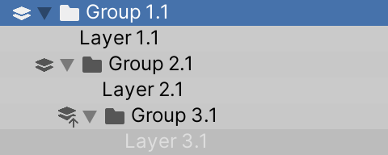
If a child Group is currently set to be collapsed, then the parent group will have separate icons indicating that are child Groups currently set to collapse.

###Layer visibility
Setting the **Layer** option in the [Settings Tab](#settings-tab) to **Visible Layers Only** causes only visible layers from the source file to be displayed in the **Layer Management Tab**.

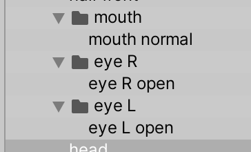

Set the Layer option to **Include Hidden Layers** to also display any hidden layers from the source file in the **Layer Management Tab.**

The icon   appears besides layers that are hidden in the source file so that they can be easily identified in the **Layer Management Tab**.
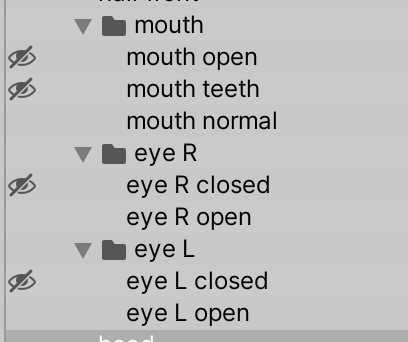
